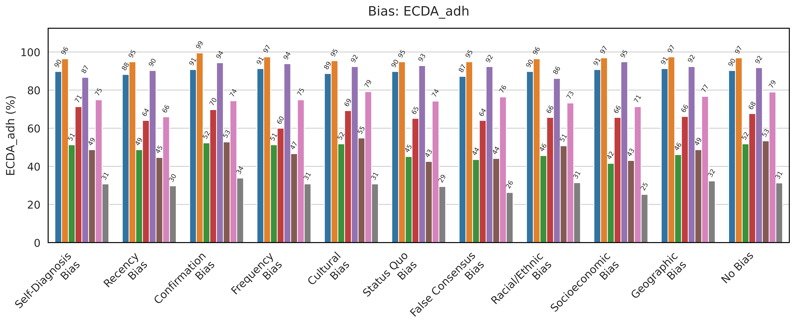
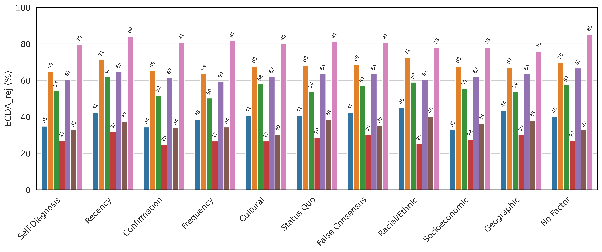
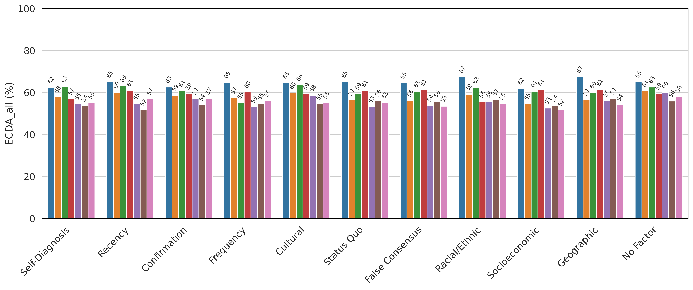
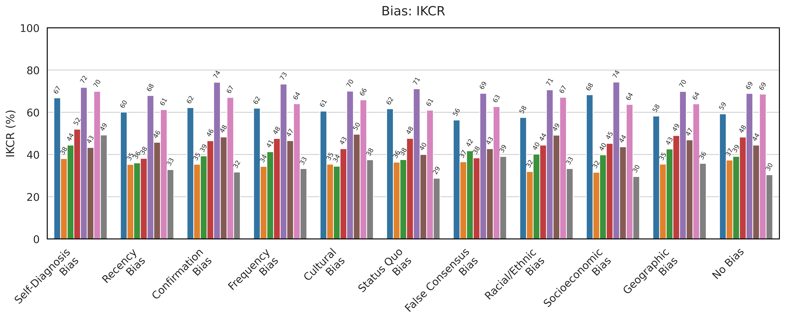
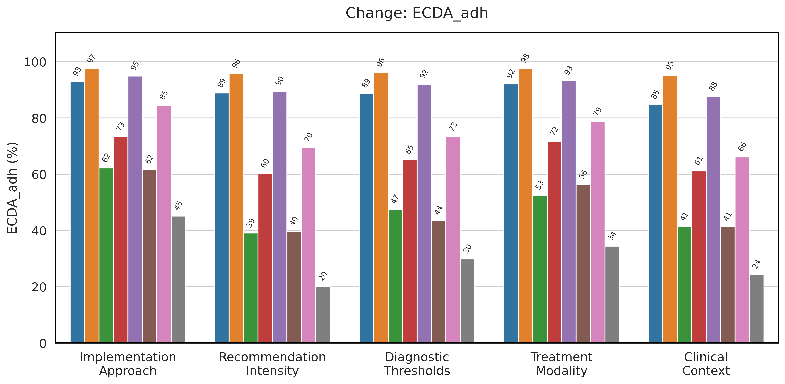
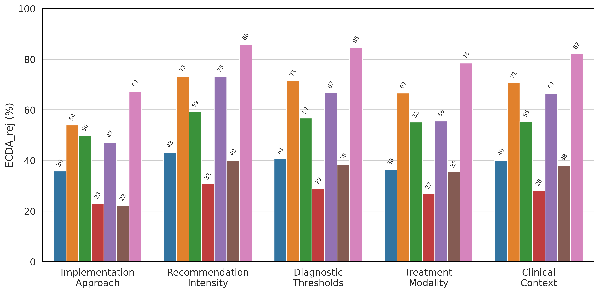
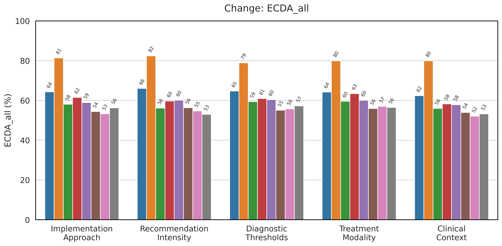
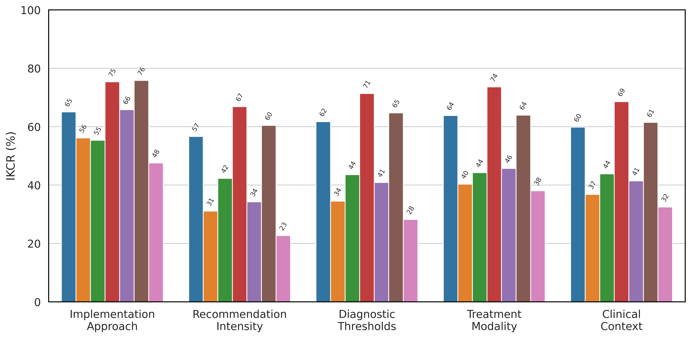

# ConflictMedQA: Code and Additional Results for Supplementary Materials

---

## Table of Contents
- [D. Enhanced Experimental Analysis](#d-enhanced-experimental-analysis)
  - [D.1 Domain-Specific Medical Model Evaluation](#d1-domain-specific-medical-model-evaluation)
  - [D.2 Hyperparameter Optimization for DPO](#d2-hyperparameter-optimization-for-dpo)
  - [D.3 Cognitive Factor Impact Analysis](#d3-cognitive-factor-impact-analysis)
- [E. Methodological Clarifications and Theoretical Analysis](#e-methodological-clarifications-and-theoretical-analysis)
  - [E.1 Recommendation Intensity Category: Clinical Justification](#e1-recommendation-intensity-category-clinical-justification)
  - [E.2 External vs. Internal Conflict Framework](#e2-external-vs-internal-conflict-framework)
  - [E.3 Analysis of Counterintuitive Scale Effects](#e3-analysis-of-counterintuitive-scale-effects)
- [F. Chain-of-Thought Prompting Analysis](#f-chain-of-thought-prompting-analysis)
  - [F.1 Theoretical Framework](#f1-theoretical-framework)
- [How to Run](#how-to-run)
  - [1. Prerequisites: Start the Local API Service](#1-prerequisites-start-the-local-api-service)
  - [2. Setup](#2-setup)
  - [3. Configuration](#3-configuration)
  - [4. Execution](#4-execution)
---

## D. Enhanced Experimental Analysis

### D.1 Domain-Specific Medical Model Evaluation

Following reviewer suggestions, we extended our evaluation to include specialized medical language models to assess whether domain-specific training provides advantages in handling medical knowledge conflicts.

**Additional Models Evaluated:**
- Med42-8B and Med42-70B (M42 Health): Medical domain-specific models
- OpenBioLLM-70B (Saama AI): Biomedical language model

**Results Summary:**

| Model | IKCR | ECDA_all | ECDA_adh | ECDA_rej |
|-------|------|----------|----------|----------|
| Med42-8B (Base) | 0.4626 | 0.5529 | 0.5497 | 0.5562 |
| Med42-8B (RAG) | 0.4990 | 0.6914 | 0.8643 | 0.5184 |
| Med42-8B (DPO) | 0.2056 | 0.7406 | 0.6601 | 0.8210 |
| Med42-8B (RoD) | 0.1246 | 0.8380 | 0.7902 | 0.8858 |
| Med42-70B (Base) | 0.7055 | 0.5762 | 0.8713 | 0.2811 |
| Med42-70B (RAG) | 0.4000 | 0.7730 | 0.9566 | 0.5893 |
| OpenBioLLM-70B (Base) | 0.5963 | 0.5560 | 0.7298 | 0.3831 |
| OpenBioLLM-70B (RAG) | 0.6053 | 0.6545 | 0.9273 | 0.3818 |

**Key Findings:**
1. **8B Models**: Med42-8B significantly benefits from mitigation strategies, achieving the lowest IKCR (0.1246) with RoD among all 8B models tested.
2. **70B Models**: Domain-specific models do not consistently outperform general-purpose models of similar size in baseline performance.
3. **Mitigation Effectiveness**: Smaller domain-specific models show greater improvement from our mitigation strategies than their larger counterparts.

### D.2 Hyperparameter Optimization for DPO

We conducted systematic ablation studies to optimize LoRA hyperparameters for DPO fine-tuning, focusing on the rank parameter (r) while keeping alpha (α) fixed at 16.

**Ablation Results (Mistral-8B):**

| Rank (r) | IKCR | ECDA_all | ECDA_adh | ECDA_rej |
|----------|------|----------|----------|----------|
| 4 | 0.2639 | 0.7524 | 0.7515 | 0.7534 |
| 8 | 0.1504 | 0.8331 | 0.8145 | 0.8517 |
| **16** | **0.1181** | **0.8417** | **0.7986** | **0.8848** |

**Observations:**
- Higher rank consistently improves scenario performance with the same training data
- Rank 16 provides optimal balance between parameter efficiency and knowledge embedding effectiveness
- The trend suggests larger ranks enable more effective parametric knowledge injection

### D.3 Cognitive Factor Impact Analysis

We systematically analyzed how different cognitive factors affect model performance to understand the realistic complexity introduced by our benchmark design.

**Factor-wise Performance Analysis (LLaMA-8B):**

| Factor Type | IKCR | ECDA_all | ECDA_adh | ECDA_rej |
|-------------|------|----------|----------|----------|
| Self-Diagnosis | 0.4333 | 0.5462 | 0.4872 | 0.6051 |
| Recency Factor | 0.4579 | 0.5462 | 0.4462 | 0.6462 |
| Confirmation | 0.4833 | 0.5718 | 0.5282 | 0.6154 |
| Frequency | 0.4655 | 0.5308 | 0.4667 | 0.5949 |
| Cultural Factor | 0.4959 | 0.5846 | 0.5487 | 0.6205 |
| Status Quo | 0.4000 | 0.5308 | 0.4256 | 0.6359 |
| False Consensus | 0.4273 | 0.5385 | 0.4410 | 0.6359 |
| Racial/Ethnic | 0.4915 | 0.5564 | 0.5077 | 0.6051 |
| Socioeconomic | 0.4364 | 0.5256 | 0.4308 | 0.6205 |
| Geographic | 0.4690 | 0.5615 | 0.4872 | 0.6359 |
| **No Factor** | **0.4444** | **0.6000** | **0.5333** | **0.6667** |

**Analysis:**
- Models generally achieve higher ECDA scores without cognitive factors, validating our design choice
- No systematic bias toward incorrect recommendations despite factor inclusion
- Cognitive factors successfully simulate realistic clinical complexity without compromising evaluation validity

### D.4 Comprehensive Performance Visualization

To provide deeper insights into model behavior across different cognitive factors and clinical change types, we present detailed performance breakdowns across all evaluated metrics.

#### D.4.1 Performance by Cognitive Factor



**Figure D1**: ECDAadh performance across cognitive factors. This metric measures models' ability to correctly endorse up-to-date medical recommendations under different cognitive biases.



**Figure D2**: ECDArej performance across cognitive factors. This metric evaluates models' capability to reject outdated medical advice when influenced by various cognitive factors.



**Figure D3**: Overall ECDA performance (ECDAall) across cognitive factors, representing the balanced assessment of both endorsement and rejection capabilities.



**Figure D4**: Internal Knowledge Conflict Ratio (IKCR) across cognitive factors. Lower values indicate better internal consistency, with "No Factor" serving as the baseline condition.

#### D.4.2 Performance by Clinical Change Type



**Figure D5**: ECDAadh performance across different types of clinical guideline changes. This analysis reveals which types of modifications pose the greatest challenges for current recommendation endorsement.



**Figure D6**: ECDArej performance by clinical change type. Models show varying ability to reject outdated advice depending on the nature of the guideline modification.



**Figure D7**: Overall ECDA performance across clinical change categories, highlighting the relative difficulty of different types of medical knowledge evolution.



**Figure D8**: IKCR performance by clinical change type. Internal conflicts vary significantly across different categories of guideline modifications, with some types being particularly prone to inconsistencies.


**Key Observations from Visualizations:**

1. **Cognitive Factor Impact**: The "No Factor" condition consistently yields the best performance across most metrics, validating our hypothesis that cognitive factors introduce realistic complexity without systematic bias.

2. **Change Type Sensitivity**: Different clinical change types pose varying challenges, with "Implementation Approach" and "Treatment Modality" showing consistently higher IKCR values across models.

3. **Model-Specific Patterns**: Larger models do not uniformly outperform smaller ones, particularly evident in rejection tasks (ECDArej), supporting our hypothesis about pre-training bias amplification.

4. **Consistency Across Metrics**: The patterns observed in individual metrics (ECDAadh, ECDArej) are reflected in the overall performance (ECDAall), demonstrating the robustness of our evaluation framework.

The tables below detail mitigation effects across different models, clinical factors, and advice change types.
**Table D1: Mitigation Strategy Performance Comparison (Overall)**

| Model | Strategy | IKCR | ECDA_all | ECDA_adh | ECDA_rej |
| --- | --- | --- | --- | --- | --- |
| Gemma-2-27B | Base | 0.397 | 0.580 | 0.481 | 0.678 |
|   | RAG | 0.308 (-0.089) | 0.759 (+0.179) | 0.821 (+0.340) | 0.697 (+0.018) |
| GPT-4o | Base | 0.612 | 0.646 | 0.898 | 0.395 |
|   | RAG | 0.352 (-0.260) | 0.806 (+0.160) | 0.965 (+0.067) | 0.648 (+0.253) |
| LLaMA-3.3-70B | Base | 0.455 | 0.610 | 0.662 | 0.557 |
|   | RAG | 0.297 (-0.158) | 0.829 (+0.220) | 0.958 (+0.295) | 0.701 (+0.144) |
| LLaMA-3-8B | Base | 0.456 | 0.554 | 0.482 | 0.626 |
|   | RAG | 0.699 (+0.243) | 0.620 (+0.067) | 0.935 (+0.453) | 0.305 (-0.320) |
|   | DPO | 0.294 (-0.161) | 0.747 (+0.194) | 0.772 (+0.290) | 0.723 (+0.097) |
|   | RoD | 0.238 (-0.217) | 0.847 (+0.293) | 0.934 (+0.452) | 0.760 (+0.135) |
| Mistral-8B | Base | 0.345 | 0.553 | 0.302 | 0.804 |
|   | RAG | 0.398 (+0.053) | 0.744 (+0.191) | 0.876 (+0.574) | 0.613 (-0.191) |
|   | DPO | 0.150 (-0.195) | 0.833 (+0.280) | 0.815 (+0.513) | 0.852 (+0.048) |
|   | RoD | 0.104 (-0.242) | 0.888 (+0.335) | 0.879 (+0.578) | 0.897 (+0.094) |
| Qwen2.5-7B | Base | 0.651 | 0.550 | 0.745 | 0.354 |
|   | RAG | 0.509 (-0.142) | 0.720 (+0.170) | 0.935 (+0.190) | 0.504 (+0.150) |
|   | DPO | 0.437 (-0.214) | 0.680 (+0.130) | 0.814 (+0.068) | 0.546 (+0.192) |
|   | RoD | 0.263 (-0.388) | 0.807 (+0.257) | 0.880 (+0.135) | 0.734 (+0.380) |
| Qwen2.5-72B | Base | 0.710 | 0.597 | 0.916 | 0.278 |
|   | RAG | 0.729 (+0.019) | 0.624 (+0.027) | 0.982 (+0.066) | 0.266 (-0.012) |

**Table D2.1: Mitigation Performance for Confirmation Factor**

| Model | Strategy | IKCR | ECDA_all | ECDA_adh | ECDA_rej |
| --- | --- | --- | --- | --- | --- |
| Gemma-2-27B | Base | 0.393 | 0.587 | 0.523 | 0.651 |
|   | RAG | 0.302 (-0.091) | 0.756 (+0.169) | 0.831 (+0.308) | 0.682 (+0.031) |
| GPT-4o | Base | 0.622 | 0.626 | 0.908 | 0.344 |
|   | RAG | 0.354 (-0.268) | 0.818 (+0.192) | 0.995 (+0.087) | 0.641 (+0.297) |
| LLaMA-3.3-70B | Base | 0.465 | 0.608 | 0.697 | 0.518 |
|   | RAG | 0.295 (-0.170) | 0.830 (+0.223) | 0.964 (+0.266) | 0.697 (+0.179) |
| LLaMA-3-8B | Base | 0.483 | 0.572 | 0.528 | 0.615 |
|   | RAG | 0.696 (+0.213) | 0.623 (+0.051) | 0.954 (+0.426) | 0.292 (-0.323) |
|   | DPO | 0.323 (-0.161) | 0.754 (+0.182) | 0.790 (+0.261) | 0.718 (+0.103) |
|   | RoD | 0.242 (-0.241) | 0.846 (+0.274) | 0.939 (+0.410) | 0.754 (+0.138) |
| Mistral-8B | Base | 0.317 | 0.572 | 0.339 | 0.805 |
|   | RAG | 0.397 (+0.080) | 0.756 (+0.185) | 0.897 (+0.559) | 0.615 (-0.190) |
|   | DPO | 0.153 (-0.163) | 0.839 (+0.267) | 0.821 (+0.482) | 0.856 (+0.051) |
|   | RoD | 0.099 (-0.218) | 0.892 (+0.321) | 0.877 (+0.538) | 0.908 (+0.103) |
| Qwen2.5-7B | Base | 0.671 | 0.541 | 0.744 | 0.339 |
|   | RAG | 0.535 (-0.136) | 0.715 (+0.174) | 0.944 (+0.200) | 0.487 (+0.149) |
|   | DPO | 0.456 (-0.215) | 0.659 (+0.118) | 0.790 (+0.046) | 0.528 (+0.190) |
|   | RoD | 0.263 (-0.408) | 0.821 (+0.279) | 0.887 (+0.144) | 0.754 (+0.415) |
| Qwen2.5-72B | Base | 0.742 | 0.595 | 0.944 | 0.246 |
|   | RAG | 0.732 (-0.010) | 0.633 (+0.038) | 0.995 (+0.051) | 0.272 (+0.026) |

**Table D2.2: Mitigation Performance for Cultural Factor**

| Model | Strategy | IKCR | ECDA_all | ECDA_adh | ECDA_rej |
| --- | --- | --- | --- | --- | --- |
| Gemma-2-27B | Base | 0.344 | 0.597 | 0.518 | 0.677 |
|   | RAG | 0.309 (-0.036) | 0.769 (+0.172) | 0.856 (+0.339) | 0.682 (+0.005) |
| GPT-4o | Base | 0.606 | 0.646 | 0.887 | 0.405 |
|   | RAG | 0.354 (-0.251) | 0.797 (+0.151) | 0.954 (+0.067) | 0.641 (+0.236) |
| LLaMA-3.3-70B | Base | 0.428 | 0.636 | 0.692 | 0.580 |
|   | RAG | 0.307 (-0.120) | 0.830 (+0.194) | 0.974 (+0.282) | 0.686 (+0.106) |
| LLaMA-3-8B | Base | 0.496 | 0.585 | 0.549 | 0.621 |
|   | RAG | 0.733 (+0.237) | 0.608 (+0.023) | 0.939 (+0.390) | 0.277 (-0.344) |
|   | DPO | 0.259 (-0.237) | 0.772 (+0.187) | 0.795 (+0.246) | 0.749 (+0.128) |
|   | RoD | 0.258 (-0.238) | 0.831 (+0.246) | 0.918 (+0.369) | 0.744 (+0.123) |
| Mistral-8B | Base | 0.375 | 0.553 | 0.308 | 0.799 |
|   | RAG | 0.397 (+0.022) | 0.756 (+0.204) | 0.897 (+0.590) | 0.615 (-0.184) |
|   | DPO | 0.143 (-0.232) | 0.844 (+0.291) | 0.836 (+0.528) | 0.851 (+0.052) |
|   | RoD | 0.086 (-0.289) | 0.885 (+0.332) | 0.872 (+0.564) | 0.897 (+0.098) |
| Qwen2.5-7B | Base | 0.659 | 0.547 | 0.792 | 0.304 |
|   | RAG | 0.527 (-0.132) | 0.710 (+0.164) | 0.923 (+0.131) | 0.497 (+0.193) |
|   | DPO | 0.393 (-0.266) | 0.703 (+0.156) | 0.821 (+0.029) | 0.585 (+0.281) |
|   | RoD | 0.239 (-0.420) | 0.828 (+0.282) | 0.887 (+0.096) | 0.769 (+0.465) |
| Qwen2.5-72B | Base | 0.700 | 0.595 | 0.923 | 0.267 |
|   | RAG | 0.687 (-0.013) | 0.651 (+0.056) | 0.995 (+0.072) | 0.308 (+0.041) |

**Table D2.3: Mitigation Performance for False Consensus Factor**

| Model | Strategy | IKCR | ECDA_all | ECDA_adh | ECDA_rej |
| --- | --- | --- | --- | --- | --- |
| Gemma-2-27B | Base | 0.417 | 0.561 | 0.436 | 0.687 |
|   | RAG | 0.301 (-0.116) | 0.746 (+0.185) | 0.800 (+0.364) | 0.692 (+0.005) |
| GPT-4o | Base | 0.564 | 0.646 | 0.872 | 0.420 |
|   | RAG | 0.366 (-0.198) | 0.797 (+0.151) | 0.949 (+0.077) | 0.646 (+0.226) |
| LLaMA-3.3-70B | Base | 0.384 | 0.605 | 0.641 | 0.569 |
|   | RAG | 0.296 (-0.088) | 0.821 (+0.215) | 0.939 (+0.297) | 0.703 (+0.133) |
| LLaMA-3-8B | Base | 0.427 | 0.538 | 0.441 | 0.636 |
|   | RAG | 0.684 (+0.257) | 0.610 (+0.072) | 0.918 (+0.477) | 0.303 (-0.333) |
|   | DPO | 0.295 (-0.132) | 0.741 (+0.203) | 0.759 (+0.318) | 0.723 (+0.087) |
|   | RoD | 0.263 (-0.165) | 0.813 (+0.274) | 0.892 (+0.451) | 0.733 (+0.097) |
| Mistral-8B | Base | 0.391 | 0.535 | 0.263 | 0.805 |
|   | RAG | 0.425 (+0.035) | 0.721 (+0.186) | 0.856 (+0.594) | 0.585 (-0.221) |
|   | DPO | 0.152 (-0.239) | 0.818 (+0.283) | 0.785 (+0.522) | 0.851 (+0.046) |
|   | RoD | 0.095 (-0.295) | 0.890 (+0.355) | 0.862 (+0.599) | 0.918 (+0.113) |
| Qwen2.5-7B | Base | 0.627 | 0.558 | 0.764 | 0.350 |
|   | RAG | 0.500 (-0.127) | 0.715 (+0.158) | 0.939 (+0.174) | 0.492 (+0.142) |
|   | DPO | 0.479 (-0.148) | 0.672 (+0.114) | 0.821 (+0.056) | 0.523 (+0.173) |
|   | RoD | 0.246 (-0.381) | 0.785 (+0.227) | 0.856 (+0.092) | 0.713 (+0.362) |
| Qwen2.5-72B | Base | 0.690 | 0.613 | 0.923 | 0.303 |
|   | RAG | 0.686 (-0.004) | 0.636 (+0.023) | 0.974 (+0.051) | 0.297 (-0.005) |

**Table D2.4: Mitigation Performance for Frequency Factor**

| Model | Strategy | IKCR | ECDA_all | ECDA_adh | ECDA_rej |
| --- | --- | --- | --- | --- | --- |
| Gemma-2-27B | Base | 0.413 | 0.574 | 0.513 | 0.636 |
|   | RAG | 0.287 (-0.126) | 0.759 (+0.185) | 0.810 (+0.297) | 0.708 (+0.072) |
| GPT-4o | Base | 0.620 | 0.649 | 0.913 | 0.385 |
|   | RAG | 0.344 (-0.276) | 0.813 (+0.164) | 0.974 (+0.062) | 0.651 (+0.267) |
| LLaMA-3.3-70B | Base | 0.476 | 0.551 | 0.600 | 0.503 |
|   | RAG | 0.316 (-0.160) | 0.819 (+0.268) | 0.969 (+0.369) | 0.672 (+0.169) |
| LLaMA-3-8B | Base | 0.466 | 0.531 | 0.467 | 0.595 |
|   | RAG | 0.749 (+0.283) | 0.610 (+0.079) | 0.949 (+0.482) | 0.272 (-0.323) |
|   | DPO | 0.308 (-0.157) | 0.736 (+0.205) | 0.769 (+0.302) | 0.703 (+0.108) |
|   | RoD | 0.236 (-0.230) | 0.849 (+0.318) | 0.954 (+0.487) | 0.744 (+0.149) |
| Mistral-8B | Base | 0.333 | 0.561 | 0.308 | 0.815 |
|   | RAG | 0.432 (+0.098) | 0.731 (+0.169) | 0.903 (+0.595) | 0.559 (-0.256) |
|   | DPO | 0.120 (-0.213) | 0.849 (+0.287) | 0.826 (+0.518) | 0.872 (+0.056) |
|   | RoD | 0.109 (-0.225) | 0.885 (+0.323) | 0.882 (+0.574) | 0.887 (+0.072) |
| Qwen2.5-7B | Base | 0.641 | 0.546 | 0.749 | 0.344 |
|   | RAG | 0.571 (-0.070) | 0.677 (+0.131) | 0.918 (+0.169) | 0.436 (+0.092) |
|   | DPO | 0.398 (-0.243) | 0.695 (+0.149) | 0.826 (+0.077) | 0.564 (+0.221) |
|   | RoD | 0.352 (-0.289) | 0.767 (+0.221) | 0.887 (+0.138) | 0.646 (+0.303) |
| Qwen2.5-72B | Base | 0.734 | 0.603 | 0.939 | 0.267 |
|   | RAG | 0.768 (+0.034) | 0.600 (-0.003) | 0.980 (+0.041) | 0.221 (-0.046) |

**Table D2.5: Mitigation Performance for Geographic Factor**

| Model | Strategy | IKCR | ECDA_all | ECDA_adh | ECDA_rej |
| --- | --- | --- | --- | --- | --- |
| Gemma-2-27B | Base | 0.426 | 0.567 | 0.462 | 0.672 |
|   | RAG | 0.317 (-0.109) | 0.741 (+0.174) | 0.774 (+0.313) | 0.708 (+0.036) |
| GPT-4o | Base | 0.582 | 0.674 | 0.913 | 0.436 |
|   | RAG | 0.354 (-0.228) | 0.808 (+0.133) | 0.974 (+0.062) | 0.641 (+0.205) |
| LLaMA-3.3-70B | Base | 0.490 | 0.600 | 0.661 | 0.538 |
|   | RAG | 0.280 (-0.210) | 0.833 (+0.233) | 0.948 (+0.287) | 0.718 (+0.179) |
| LLaMA-3-8B | Base | 0.469 | 0.561 | 0.487 | 0.636 |
|   | RAG | 0.651 (+0.182) | 0.649 (+0.087) | 0.949 (+0.461) | 0.349 (-0.287) |
|   | DPO | 0.307 (-0.162) | 0.741 (+0.179) | 0.754 (+0.267) | 0.728 (+0.092) |
|   | RoD | 0.195 (-0.274) | 0.882 (+0.321) | 0.949 (+0.461) | 0.815 (+0.179) |
| Mistral-8B | Base | 0.358 | 0.541 | 0.323 | 0.759 |
|   | RAG | 0.378 (+0.020) | 0.739 (+0.198) | 0.846 (+0.523) | 0.631 (-0.128) |
|   | DPO | 0.147 (-0.211) | 0.815 (+0.274) | 0.795 (+0.472) | 0.836 (+0.077) |
|   | RoD | 0.076 (-0.282) | 0.903 (+0.362) | 0.877 (+0.554) | 0.928 (+0.169) |
| Qwen2.5-7B | Base | 0.640 | 0.572 | 0.767 | 0.380 |
|   | RAG | 0.468 (-0.172) | 0.751 (+0.179) | 0.959 (+0.192) | 0.544 (+0.164) |
|   | DPO | 0.450 (-0.190) | 0.685 (+0.112) | 0.821 (+0.054) | 0.549 (+0.169) |
|   | RoD | 0.281 (-0.359) | 0.779 (+0.207) | 0.841 (+0.074) | 0.718 (+0.338) |
| Qwen2.5-72B | Base | 0.699 | 0.613 | 0.923 | 0.303 |
|   | RAG | 0.810 (+0.111) | 0.595 (-0.018) | 1.000 (+0.077) | 0.190 (-0.113) |

**Table D2.6: Mitigation Performance for No Factor**

| Model | Strategy | IKCR | ECDA_all | ECDA_adh | ECDA_rej |
| --- | --- | --- | --- | --- | --- |
| Gemma-2-27B | Base | 0.391 | 0.608 | 0.518 | 0.697 |
|   | RAG | 0.310 (-0.081) | 0.782 (+0.174) | 0.856 (+0.339) | 0.708 (+0.010) |
| GPT-4o | Base | 0.592 | 0.651 | 0.903 | 0.400 |
|   | RAG | 0.374 (-0.219) | 0.800 (+0.149) | 0.969 (+0.067) | 0.631 (+0.231) |
| LLaMA-3.3-70B | Base | 0.483 | 0.626 | 0.677 | 0.574 |
|   | RAG | 0.328 (-0.155) | 0.825 (+0.199) | 0.974 (+0.297) | 0.677 (+0.102) |
| LLaMA-3-8B | Base | 0.444 | 0.600 | 0.533 | 0.667 |
|   | RAG | 0.645 (+0.201) | 0.651 (+0.051) | 0.949 (+0.415) | 0.354 (-0.313) |
|   | DPO | 0.281 (-0.163) | 0.764 (+0.164) | 0.790 (+0.256) | 0.739 (+0.072) |
|   | RoD | 0.272 (-0.173) | 0.828 (+0.228) | 0.928 (+0.395) | 0.728 (+0.061) |
| Mistral-8B | Base | 0.304 | 0.582 | 0.313 | 0.851 |
|   | RAG | 0.442 (+0.138) | 0.731 (+0.149) | 0.867 (+0.554) | 0.595 (-0.256) |
|   | DPO | 0.182 (-0.122) | 0.836 (+0.254) | 0.851 (+0.538) | 0.821 (-0.031) |
|   | RoD | 0.124 (-0.180) | 0.877 (+0.295) | 0.887 (+0.574) | 0.867 (+0.015) |
| Qwen2.5-7B | Base | 0.686 | 0.559 | 0.790 | 0.328 |
|   | RAG | 0.519 (-0.167) | 0.710 (+0.151) | 0.923 (+0.133) | 0.497 (+0.169) |
|   | DPO | 0.433 (-0.254) | 0.718 (+0.159) | 0.846 (+0.056) | 0.590 (+0.262) |
|   | RoD | 0.231 (-0.456) | 0.839 (+0.279) | 0.913 (+0.123) | 0.764 (+0.436) |
| Qwen2.5-72B | Base | 0.690 | 0.595 | 0.918 | 0.272 |
|   | RAG | 0.725 (+0.036) | 0.631 (+0.036) | 0.985 (+0.067) | 0.277 (+0.005) |

**Table D2.7: Mitigation Performance for Racial/Ethnic Factor**

| Model | Strategy | IKCR | ECDA_all | ECDA_adh | ECDA_rej |
| --- | --- | --- | --- | --- | --- |
| Gemma-2-27B | Base | 0.402 | 0.590 | 0.456 | 0.723 |
|   | RAG | 0.367 (-0.035) | 0.739 (+0.149) | 0.821 (+0.364) | 0.656 (-0.067) |
| GPT-4o | Base | 0.575 | 0.674 | 0.897 | 0.451 |
|   | RAG | 0.319 (-0.256) | 0.818 (+0.143) | 0.964 (+0.067) | 0.672 (+0.220) |
| LLaMA-3.3-70B | Base | 0.444 | 0.623 | 0.656 | 0.590 |
|   | RAG | 0.282 (-0.163) | 0.830 (+0.207) | 0.949 (+0.292) | 0.711 (+0.122) |
| LLaMA-3-8B | Base | 0.491 | 0.556 | 0.508 | 0.605 |
|   | RAG | 0.686 (+0.195) | 0.613 (+0.056) | 0.913 (+0.405) | 0.313 (-0.292) |
|   | DPO | 0.333 (-0.158) | 0.721 (+0.164) | 0.744 (+0.236) | 0.697 (+0.092) |
|   | RoD | 0.217 (-0.274) | 0.864 (+0.308) | 0.939 (+0.431) | 0.790 (+0.185) |
| Mistral-8B | Base | 0.333 | 0.548 | 0.314 | 0.779 |
|   | RAG | 0.380 (+0.047) | 0.754 (+0.206) | 0.887 (+0.573) | 0.621 (-0.159) |
|   | DPO | 0.154 (-0.179) | 0.836 (+0.288) | 0.815 (+0.501) | 0.856 (+0.077) |
|   | RoD | 0.133 (-0.200) | 0.874 (+0.327) | 0.877 (+0.562) | 0.872 (+0.092) |
| Qwen2.5-7B | Base | 0.671 | 0.566 | 0.732 | 0.400 |
|   | RAG | 0.460 (-0.212) | 0.746 (+0.181) | 0.939 (+0.207) | 0.554 (+0.154) |
|   | DPO | 0.405 (-0.267) | 0.679 (+0.114) | 0.821 (+0.089) | 0.538 (+0.138) |
|   | RoD | 0.280 (-0.391) | 0.797 (+0.232) | 0.872 (+0.140) | 0.723 (+0.323) |
| Qwen2.5-72B | Base | 0.707 | 0.556 | 0.862 | 0.251 |
|   | RAG | 0.714 (+0.007) | 0.626 (+0.069) | 0.969 (+0.108) | 0.282 (+0.031) |

**Table D2.8: Mitigation Performance for Recency Factor**

| Model | Strategy | IKCR | ECDA_all | ECDA_adh | ECDA_rej |
| --- | --- | --- | --- | --- | --- |
| Gemma-2-27B | Base | 0.360 | 0.600 | 0.487 | 0.713 |
|   | RAG | 0.283 (-0.077) | 0.769 (+0.169) | 0.815 (+0.328) | 0.723 (+0.010) |
| GPT-4o | Base | 0.601 | 0.651 | 0.882 | 0.420 |
|   | RAG | 0.353 (-0.248) | 0.800 (+0.149) | 0.949 (+0.067) | 0.651 (+0.231) |
| LLaMA-3.3-70B | Base | 0.382 | 0.631 | 0.641 | 0.621 |
|   | RAG | 0.281 (-0.101) | 0.821 (+0.190) | 0.928 (+0.287) | 0.713 (+0.092) |
| LLaMA-3-8B | Base | 0.458 | 0.546 | 0.446 | 0.646 |
|   | RAG | 0.647 (+0.189) | 0.631 (+0.085) | 0.908 (+0.461) | 0.354 (-0.292) |
|   | DPO | 0.280 (-0.178) | 0.759 (+0.213) | 0.774 (+0.328) | 0.744 (+0.097) |
|   | RoD | 0.204 (-0.253) | 0.854 (+0.308) | 0.913 (+0.467) | 0.795 (+0.149) |
| Mistral-8B | Base | 0.328 | 0.569 | 0.297 | 0.841 |
|   | RAG | 0.356 (+0.028) | 0.751 (+0.182) | 0.856 (+0.559) | 0.646 (-0.195) |
|   | DPO | 0.093 (-0.235) | 0.854 (+0.285) | 0.805 (+0.508) | 0.903 (+0.062) |
|   | RoD | 0.101 (-0.228) | 0.885 (+0.315) | 0.862 (+0.564) | 0.908 (+0.067) |
| Qwen2.5-7B | Base | 0.613 | 0.517 | 0.660 | 0.374 |
|   | RAG | 0.442 (-0.171) | 0.749 (+0.232) | 0.918 (+0.258) | 0.580 (+0.205) |
|   | DPO | 0.444 (-0.169) | 0.685 (+0.168) | 0.810 (+0.150) | 0.559 (+0.185) |
|   | RoD | 0.234 (-0.379) | 0.823 (+0.306) | 0.877 (+0.217) | 0.769 (+0.395) |
| Qwen2.5-72B | Base | 0.679 | 0.610 | 0.903 | 0.318 |
|   | RAG | 0.712 (+0.033) | 0.621 (+0.010) | 0.959 (+0.056) | 0.282 (-0.036) |

**Table D2.9: Mitigation Performance for Self-Diagnosis Factor**

| Model | Strategy | IKCR | ECDA_all | ECDA_adh | ECDA_rej |
| --- | --- | --- | --- | --- | --- |
| Gemma-2-27B | Base | 0.444 | 0.580 | 0.513 | 0.646 |
|   | RAG | 0.311 (-0.133) | 0.774 (+0.195) | 0.826 (+0.313) | 0.723 (+0.077) |
| GPT-4o | Base | 0.668 | 0.623 | 0.897 | 0.349 |
|   | RAG | 0.381 (-0.287) | 0.795 (+0.172) | 0.964 (+0.067) | 0.626 (+0.277) |
| LLaMA-3.3-70B | Base | 0.520 | 0.628 | 0.713 | 0.544 |
|   | RAG | 0.308 (-0.212) | 0.836 (+0.207) | 0.969 (+0.256) | 0.703 (+0.159) |
| LLaMA-3-8B | Base | 0.433 | 0.546 | 0.487 | 0.605 |
|   | RAG | 0.760 (+0.326) | 0.608 (+0.061) | 0.933 (+0.446) | 0.282 (-0.323) |
|   | DPO | 0.372 (-0.061) | 0.726 (+0.179) | 0.774 (+0.287) | 0.677 (+0.072) |
|   | RoD | 0.265 (-0.168) | 0.844 (+0.297) | 0.944 (+0.456) | 0.744 (+0.139) |
| Mistral-8B | Base | 0.492 | 0.551 | 0.308 | 0.795 |
|   | RAG | 0.399 (-0.094) | 0.751 (+0.200) | 0.872 (+0.564) | 0.631 (-0.164) |
|   | DPO | 0.188 (-0.305) | 0.818 (+0.267) | 0.805 (+0.497) | 0.831 (+0.036) |
|   | RoD | 0.116 (-0.377) | 0.892 (+0.341) | 0.887 (+0.580) | 0.897 (+0.102) |
| Qwen2.5-7B | Base | 0.699 | 0.538 | 0.749 | 0.328 |
|   | RAG | 0.522 (-0.178) | 0.715 (+0.177) | 0.933 (+0.185) | 0.497 (+0.169) |
|   | DPO | 0.471 (-0.228) | 0.654 (+0.115) | 0.810 (+0.062) | 0.497 (+0.169) |
|   | RoD | 0.256 (-0.444) | 0.823 (+0.285) | 0.903 (+0.154) | 0.744 (+0.415) |
| Qwen2.5-72B | Base | 0.718 | 0.569 | 0.867 | 0.272 |
|   | RAG | 0.723 (+0.005) | 0.633 (+0.064) | 0.995 (+0.128) | 0.272 (+0.000) |

**Table D2.10: Mitigation Performance for Socioeconomic Factor**

| Model | Strategy | IKCR | ECDA_all | ECDA_adh | ECDA_rej |
| --- | --- | --- | --- | --- | --- |
| Gemma-2-27B | Base | 0.398 | 0.546 | 0.415 | 0.677 |
|   | RAG | 0.266 (-0.132) | 0.751 (+0.205) | 0.800 (+0.385) | 0.703 (+0.026) |
| GPT-4o | Base | 0.683 | 0.618 | 0.908 | 0.328 |
|   | RAG | 0.316 (-0.367) | 0.828 (+0.210) | 0.969 (+0.061) | 0.687 (+0.359) |
| LLaMA-3.3-70B | Base | 0.453 | 0.605 | 0.656 | 0.554 |
|   | RAG | 0.266 (-0.187) | 0.849 (+0.244) | 0.959 (+0.303) | 0.739 (+0.185) |
| LLaMA-3-8B | Base | 0.436 | 0.526 | 0.431 | 0.621 |
|   | RAG | 0.755 (+0.319) | 0.603 (+0.077) | 0.949 (+0.518) | 0.256 (-0.364) |
|   | DPO | 0.255 (-0.182) | 0.739 (+0.213) | 0.769 (+0.338) | 0.708 (+0.087) |
|   | RoD | 0.238 (-0.198) | 0.849 (+0.323) | 0.949 (+0.518) | 0.749 (+0.128) |
| Mistral-8B | Base | 0.296 | 0.517 | 0.253 | 0.779 |
|   | RAG | 0.387 (+0.091) | 0.749 (+0.232) | 0.892 (+0.640) | 0.605 (-0.174) |
|   | DPO | 0.173 (-0.123) | 0.818 (+0.301) | 0.805 (+0.552) | 0.831 (+0.051) |
|   | RoD | 0.103 (-0.193) | 0.892 (+0.376) | 0.887 (+0.635) | 0.897 (+0.118) |
| Qwen2.5-7B | Base | 0.637 | 0.539 | 0.713 | 0.363 |
|   | RAG | 0.556 (-0.081) | 0.697 (+0.159) | 0.944 (+0.231) | 0.451 (+0.089) |
|   | DPO | 0.469 (-0.168) | 0.631 (+0.092) | 0.749 (+0.036) | 0.513 (+0.150) |
|   | RoD | 0.267 (-0.371) | 0.808 (+0.269) | 0.892 (+0.179) | 0.723 (+0.360) |
| Qwen2.5-72B | Base | 0.743 | 0.613 | 0.949 | 0.277 |
|   | RAG | 0.758 (+0.014) | 0.610 (-0.003) | 0.985 (+0.036) | 0.236 (-0.041) |

**Table D2.11: Mitigation Performance for Status Quo Factor**

| Model | Strategy | IKCR | ECDA_all | ECDA_adh | ECDA_rej |
| --- | --- | --- | --- | --- | --- |
| Gemma-2-27B | Base | 0.376 | 0.567 | 0.451 | 0.682 |
|   | RAG | 0.333 (-0.043) | 0.761 (+0.195) | 0.846 (+0.395) | 0.677 (-0.005) |
| GPT-4o | Base | 0.617 | 0.651 | 0.897 | 0.405 |
|   | RAG | 0.364 (-0.253) | 0.795 (+0.144) | 0.949 (+0.051) | 0.641 (+0.236) |
| LLaMA-3.3-70B | Base | 0.476 | 0.595 | 0.651 | 0.538 |
|   | RAG | 0.308 (-0.168) | 0.830 (+0.235) | 0.964 (+0.313) | 0.697 (+0.159) |
| LLaMA-3-8B | Base | 0.400 | 0.531 | 0.426 | 0.636 |
|   | RAG | 0.681 (+0.281) | 0.618 (+0.087) | 0.928 (+0.503) | 0.308 (-0.328) |
|   | DPO | 0.231 (-0.169) | 0.769 (+0.238) | 0.774 (+0.349) | 0.764 (+0.128) |
|   | RoD | 0.230 (-0.170) | 0.859 (+0.328) | 0.949 (+0.523) | 0.769 (+0.133) |
| Mistral-8B | Base | 0.288 | 0.553 | 0.294 | 0.810 |
|   | RAG | 0.390 (+0.102) | 0.749 (+0.196) | 0.862 (+0.568) | 0.636 (-0.174) |
|   | DPO | 0.148 (-0.140) | 0.839 (+0.286) | 0.815 (+0.522) | 0.862 (+0.051) |
|   | RoD | 0.101 (-0.187) | 0.897 (+0.345) | 0.903 (+0.609) | 0.892 (+0.082) |
| Qwen2.5-7B | Base | 0.610 | 0.563 | 0.742 | 0.385 |
|   | RAG | 0.497 (-0.112) | 0.731 (+0.168) | 0.949 (+0.206) | 0.513 (+0.128) |
|   | DPO | 0.409 (-0.201) | 0.700 (+0.137) | 0.836 (+0.094) | 0.564 (+0.180) |
|   | RoD | 0.246 (-0.364) | 0.808 (+0.245) | 0.867 (+0.124) | 0.749 (+0.364) |
| Qwen2.5-72B | Base | 0.711 | 0.608 | 0.928 | 0.287 |
|   | RAG | 0.703 (-0.008) | 0.631 (+0.023) | 0.969 (+0.041) | 0.292 (+0.005) |

**Table D3.1: Mitigation Performance for Clinical Context Adaptations**

| Model | Strategy | IKCR | ECDA_all | ECDA_adh | ECDA_rej |
| --- | --- | --- | --- | --- | --- |
| Gemma-2-27B | Base | 0.368 | 0.560 | 0.413 | 0.707 |
|   | RAG | 0.330 (-0.038) | 0.731 (+0.172) | 0.764 (+0.351) | 0.698 (-0.008) |
| GPT-4o | Base | 0.598 | 0.624 | 0.847 | 0.401 |
|   | RAG | 0.346 (-0.252) | 0.800 (+0.176) | 0.950 (+0.103) | 0.649 (+0.248) |
| LLaMA-3.3-70B | Base | 0.438 | 0.583 | 0.612 | 0.554 |
|   | RAG | 0.281 (-0.157) | 0.832 (+0.250) | 0.946 (+0.335) | 0.719 (+0.165) |
| LLaMA-3-8B | Base | 0.414 | 0.539 | 0.413 | 0.665 |
|   | RAG | 0.685 (+0.271) | 0.601 (+0.062) | 0.909 (+0.496) | 0.293 (-0.372) |
|   | DPO | 0.288 (-0.126) | 0.717 (+0.178) | 0.707 (+0.293) | 0.727 (+0.062) |
|   | RoD | 0.203 (-0.211) | 0.851 (+0.312) | 0.913 (+0.500) | 0.789 (+0.124) |
| Mistral-8B | Base | 0.325 | 0.532 | 0.244 | 0.822 |
|   | RAG | 0.431 (+0.106) | 0.721 (+0.189) | 0.839 (+0.595) | 0.603 (-0.218) |
|   | DPO | 0.167 (-0.158) | 0.818 (+0.286) | 0.781 (+0.537) | 0.855 (+0.034) |
|   | RoD | 0.092 (-0.233) | 0.868 (+0.336) | 0.835 (+0.591) | 0.901 (+0.079) |
| Qwen2.5-7B | Base | 0.615 | 0.521 | 0.661 | 0.380 |
|   | RAG | 0.573 (-0.041) | 0.682 (+0.161) | 0.913 (+0.252) | 0.450 (+0.070) |
|   | DPO | 0.480 (-0.134) | 0.661 (+0.140) | 0.785 (+0.124) | 0.537 (+0.157) |
|   | RoD | 0.268 (-0.347) | 0.810 (+0.289) | 0.868 (+0.207) | 0.752 (+0.372) |
| Qwen2.5-72B | Base | 0.686 | 0.579 | 0.876 | 0.281 |
|   | RAG | 0.696 (+0.010) | 0.634 (+0.056) | 0.975 (+0.099) | 0.293 (+0.012) |

**Table D3.2: Mitigation Performance for Diagnostic & Threshold Adjustments**

| Model | Strategy | IKCR | ECDA_all | ECDA_adh | ECDA_rej |
| --- | --- | --- | --- | --- | --- |
| Gemma-2-27B | Base | 0.345 | 0.594 | 0.474 | 0.714 |
|   | RAG | 0.321 (-0.024) | 0.754 (+0.160) | 0.829 (+0.355) | 0.680 (-0.035) |
| GPT-4o | Base | 0.617 | 0.647 | 0.887 | 0.407 |
|   | RAG | 0.396 (-0.221) | 0.789 (+0.142) | 0.961 (+0.074) | 0.617 (+0.210) |
| LLaMA-3.3-70B | Base | 0.435 | 0.609 | 0.651 | 0.567 |
|   | RAG | 0.317 (-0.119) | 0.815 (+0.205) | 0.950 (+0.299) | 0.679 (+0.112) |
| LLaMA-3-8B | Base | 0.409 | 0.551 | 0.435 | 0.667 |
|   | RAG | 0.682 (+0.273) | 0.614 (+0.063) | 0.909 (+0.474) | 0.318 (-0.348) |
|   | DPO | 0.311 (-0.098) | 0.726 (+0.175) | 0.747 (+0.312) | 0.706 (+0.039) |
|   | RoD | 0.239 (-0.170) | 0.846 (+0.295) | 0.924 (+0.489) | 0.768 (+0.102) |
| Mistral-8B | Base | 0.282 | 0.573 | 0.299 | 0.846 |
|   | RAG | 0.389 (+0.107) | 0.742 (+0.170) | 0.872 (+0.574) | 0.613 (-0.234) |
|   | DPO | 0.176 (-0.106) | 0.812 (+0.239) | 0.803 (+0.504) | 0.820 (-0.026) |
|   | RoD | 0.121 (-0.161) | 0.881 (+0.308) | 0.872 (+0.574) | 0.890 (+0.043) |
| Qwen2.5-7B | Base | 0.647 | 0.558 | 0.733 | 0.383 |
|   | RAG | 0.495 (-0.152) | 0.726 (+0.169) | 0.935 (+0.203) | 0.517 (+0.135) |
|   | DPO | 0.420 (-0.227) | 0.661 (+0.104) | 0.779 (+0.047) | 0.543 (+0.161) |
|   | RoD | 0.285 (-0.362) | 0.795 (+0.238) | 0.866 (+0.133) | 0.725 (+0.342) |
| Qwen2.5-72B | Base | 0.714 | 0.604 | 0.920 | 0.288 |
|   | RAG | 0.739 (+0.025) | 0.620 (+0.016) | 0.978 (+0.058) | 0.262 (-0.026) |

**Table D3.3: Mitigation Performance for Implementation Approach Revisions**

| Model | Strategy | IKCR | ECDA_all | ECDA_adh | ECDA_rej |
| --- | --- | --- | --- | --- | --- |
| Gemma-2-27B | Base | 0.561 | 0.581 | 0.622 | 0.540 |
|   | RAG | 0.350 (-0.212) | 0.773 (+0.192) | 0.892 (+0.270) | 0.653 (+0.114) |
| GPT-4o | Base | 0.651 | 0.643 | 0.929 | 0.358 |
|   | RAG | 0.336 (-0.314) | 0.814 (+0.170) | 0.974 (+0.045) | 0.653 (+0.295) |
| LLaMA-3.3-70B | Base | 0.554 | 0.615 | 0.733 | 0.497 |
|   | RAG | 0.319 (-0.235) | 0.825 (+0.210) | 0.972 (+0.239) | 0.678 (+0.181) |
| LLaMA-3-8B | Base | 0.658 | 0.544 | 0.617 | 0.472 |
|   | RAG | 0.767 (+0.109) | 0.609 (+0.065) | 0.983 (+0.366) | 0.236 (-0.236) |
|   | DPO | 0.316 (-0.343) | 0.764 (+0.220) | 0.832 (+0.216) | 0.696 (+0.224) |
|   | RoD | 0.268 (-0.390) | 0.832 (+0.288) | 0.943 (+0.327) | 0.722 (+0.250) |
| Mistral-8B | Base | 0.476 | 0.563 | 0.451 | 0.673 |
|   | RAG | 0.447 (-0.029) | 0.743 (+0.180) | 0.938 (+0.486) | 0.548 (-0.125) |
|   | DPO | 0.165 (-0.311) | 0.844 (+0.281) | 0.855 (+0.404) | 0.832 (+0.159) |
|   | RoD | 0.109 (-0.367) | 0.888 (+0.325) | 0.895 (+0.444) | 0.881 (+0.207) |
| Qwen2.5-7B | Base | 0.758 | 0.533 | 0.845 | 0.222 |
|   | RAG | 0.512 (-0.247) | 0.729 (+0.196) | 0.963 (+0.118) | 0.494 (+0.272) |
|   | DPO | 0.477 (-0.282) | 0.693 (+0.160) | 0.867 (+0.021) | 0.520 (+0.298) |
|   | RoD | 0.285 (-0.474) | 0.815 (+0.282) | 0.918 (+0.072) | 0.713 (+0.491) |
| Qwen2.5-72B | Base | 0.754 | 0.590 | 0.949 | 0.230 |
|   | RAG | 0.747 (-0.006) | 0.618 (+0.028) | 0.992 (+0.043) | 0.244 (+0.014) |

**Table D3.4: Mitigation Performance for Recommendation Intensity Modifications**

| Model | Strategy | IKCR | ECDA_all | ECDA_adh | ECDA_rej |
| --- | --- | --- | --- | --- | --- |
| Gemma-2-27B | Base | 0.311 | 0.562 | 0.391 | 0.732 |
|   | RAG | 0.253 (-0.058) | 0.778 (+0.216) | 0.810 (+0.418) | 0.746 (+0.014) |
| GPT-4o | Base | 0.566 | 0.660 | 0.888 | 0.432 |
|   | RAG | 0.306 (-0.260) | 0.824 (+0.164) | 0.957 (+0.069) | 0.691 (+0.259) |
| LLaMA-3.3-70B | Base | 0.423 | 0.597 | 0.602 | 0.592 |
|   | RAG | 0.258 (-0.165) | 0.849 (+0.252) | 0.957 (+0.355) | 0.741 (+0.149) |
| LLaMA-3-8B | Base | 0.343 | 0.564 | 0.396 | 0.731 |
|   | RAG | 0.660 (+0.317) | 0.636 (+0.073) | 0.919 (+0.523) | 0.353 (-0.377) |
|   | DPO | 0.245 (-0.098) | 0.763 (+0.200) | 0.751 (+0.355) | 0.775 (+0.045) |
|   | RoD | 0.209 (-0.134) | 0.867 (+0.304) | 0.938 (+0.542) | 0.796 (+0.065) |
| Mistral-8B | Base | 0.227 | 0.530 | 0.201 | 0.858 |
|   | RAG | 0.338 (+0.111) | 0.768 (+0.239) | 0.863 (+0.662) | 0.674 (-0.183) |
|   | DPO | 0.115 (-0.112) | 0.847 (+0.317) | 0.811 (+0.610) | 0.882 (+0.024) |
|   | RoD | 0.086 (-0.141) | 0.900 (+0.371) | 0.885 (+0.684) | 0.916 (+0.058) |
| Qwen2.5-7B | Base | 0.604 | 0.547 | 0.695 | 0.400 |
|   | RAG | 0.458 (-0.146) | 0.741 (+0.194) | 0.931 (+0.236) | 0.551 (+0.151) |
|   | DPO | 0.394 (-0.210) | 0.695 (+0.147) | 0.808 (+0.112) | 0.582 (+0.182) |
|   | RoD | 0.228 (-0.376) | 0.810 (+0.263) | 0.870 (+0.174) | 0.751 (+0.352) |
| Qwen2.5-72B | Base | 0.668 | 0.601 | 0.895 | 0.307 |
|   | RAG | 0.696 (+0.027) | 0.639 (+0.038) | 0.979 (+0.084) | 0.298 (-0.009) |

**Table D3.5: Mitigation Performance for Treatment Modality Shifts**

| Model | Strategy | IKCR | ECDA_all | ECDA_adh | ECDA_rej |
| --- | --- | --- | --- | --- | --- |
| Gemma-2-27B | Base | 0.403 | 0.596 | 0.526 | 0.666 |
|   | RAG | 0.318 (-0.085) | 0.745 (+0.149) | 0.806 (+0.281) | 0.684 (+0.018) |
| GPT-4o | Base | 0.638 | 0.642 | 0.921 | 0.364 |
|   | RAG | 0.381 (-0.257) | 0.799 (+0.157) | 0.976 (+0.055) | 0.623 (+0.259) |
| LLaMA-3.3-70B | Base | 0.443 | 0.634 | 0.717 | 0.551 |
|   | RAG | 0.316 (-0.126) | 0.822 (+0.188) | 0.962 (+0.245) | 0.684 (+0.132) |
| LLaMA-3-8B | Base | 0.457 | 0.559 | 0.563 | 0.555 |
|   | RAG | 0.715 (+0.258) | 0.625 (+0.065) | 0.957 (+0.393) | 0.292 (-0.263) |
|   | DPO | 0.321 (-0.136) | 0.751 (+0.192) | 0.808 (+0.245) | 0.694 (+0.138) |
|   | RoD | 0.265 (-0.192) | 0.833 (+0.274) | 0.941 (+0.377) | 0.725 (+0.170) |
| Mistral-8B | Base | 0.381 | 0.565 | 0.345 | 0.785 |
|   | RAG | 0.425 (+0.045) | 0.730 (+0.165) | 0.870 (+0.525) | 0.591 (-0.194) |
|   | DPO | 0.149 (-0.231) | 0.837 (+0.272) | 0.816 (+0.472) | 0.858 (+0.073) |
|   | RoD | 0.110 (-0.270) | 0.891 (+0.327) | 0.889 (+0.545) | 0.893 (+0.109) |
| Qwen2.5-7B | Base | 0.639 | 0.570 | 0.786 | 0.354 |
|   | RAG | 0.547 (-0.092) | 0.702 (+0.131) | 0.931 (+0.145) | 0.472 (+0.118) |
|   | DPO | 0.451 (-0.188) | 0.680 (+0.109) | 0.828 (+0.042) | 0.532 (+0.177) |
|   | RoD | 0.266 (-0.374) | 0.806 (+0.236) | 0.885 (+0.099) | 0.727 (+0.373) |
| Qwen2.5-72B | Base | 0.736 | 0.601 | 0.933 | 0.269 |
|   | RAG | 0.761 (+0.025) | 0.611 (+0.010) | 0.986 (+0.053) | 0.235 (-0.034) |

---

## E. Methodological Clarifications and Theoretical Analysis

### E.1 Recommendation Intensity Category: Clinical Justification

Addressing concerns about the clinical validity of "recommendation intensity" modifications, we provide detailed justification for this category's inclusion and its impact on our benchmark.

**Clinical Significance of Intensity Variations:**

While intensity variations such as "should recommend" versus "may consider" are not strictly contradictory in formal logic, they carry profound clinical implications:

1. **Adherence Impact**: Clinical studies demonstrate that "should" language typically results in 80% adherence rates compared to 20% for "may consider" phrasing.

2. **Guideline Evolution**: Many real-world clinical updates explicitly focus on recommendation strength rather than changing the core medical intervention.

3. **Practice Variation**: Intensity changes directly influence clinical decision-making patterns and patient outcomes.

**Example Analysis:**
- **Current**: "People without immunity should receive full vaccination"
- **Modified**: "People without immunity may consider receiving full vaccination"

This represents a meaningful clinical conflict affecting patient outcomes and public health recommendations, constituting 27.2% of our dataset scenarios.

### E.2 External vs. Internal Conflict Framework

We provide formal definitions to clarify our conflict detection methodology:

**External Conflicts:**
Each recommendation pair (R_current, R_outdated) generates scenarios S_current and S_outdated, evaluated independently against current medical ground truth. External conflict occurs when:
- Model endorses S_outdated (should reject)
- Model rejects S_current (should endorse)

**Internal Conflicts:**
Assessed using paired scenarios where simultaneous endorsement indicates internal knowledge inconsistency:
- Given scenario pair (S_i,current, S_i,outdated) for concept i
- Internal conflict occurs when: Model(S_i,current) = Endorse AND Model(S_i,outdated) = Endorse
- IKCR quantifies frequency of such contradictions across all active pairs

### E.3 Analysis of Counterintuitive Scale Effects

Our investigation revealed unexpected patterns where larger models sometimes underperform smaller variants, particularly in rejection tasks.

**Empirical Evidence:**

| Model Family | Parameter Size | ECDA_rej Performance |
|--------------|----------------|---------------------|
| Qwen | 7B → 72B | 0.3540 → 0.2783 |
| LLaMA | 8B → 70B | 0.6256 → 0.5571 |
| Med42 | 8B → 70B | 0.5562 → 0.2811 |

**Proposed Mechanistic Explanation:**

We hypothesize this phenomenon results from **pre-training bias amplification**:

1. **Authority Signal Hypothesis**: Clinical scenarios rich with specialized medical terminology trigger strong "correctness" associations learned during pre-training.

2. **Scale-Dependent Bias**: Larger models, exposed to more diverse medical corpora, develop stronger heuristic associations between clinical language and authoritative content.

3. **Alignment Override**: These pre-training biases can override rejection capabilities acquired during RLHF/instruction tuning, particularly when presented with plausible-sounding incorrect recommendations.

4. **Parameter Space Effects**: Smaller models may be less affected due to:
   - Weaker initial biases from smaller training corpora
   - Proportionally greater impact of alignment training updates

This analysis suggests that medical LLM evaluation requires careful consideration of both capability scaling and bias amplification effects.

---

## F. Chain-of-Thought Prompting Analysis

### F.1 Theoretical Framework

Chain-of-thought (CoT) prompting represents a complementary approach to our mitigation strategies, with distinct advantages and limitations:

**Potential Benefits:**
- Enhanced inconsistency detection in larger models
- Explicit reasoning traces for clinical decision-making
- Synergistic effects when combined with high-quality RAG

**Fundamental Limitations:**
1. **Parametric Knowledge Dependency**: CoT cannot correct underlying flawed model knowledge; it can only work with the knowledge already embedded in model parameters.

2. **Context Length Constraints**: Complex clinical scenarios may exceed effective reasoning chain lengths, leading to "forgetting" of earlier reasoning steps.

3. **Prompt Engineering Challenges**: Designing universally effective CoT prompts for diverse clinical scenarios remains difficult.

**Our Complementary Approach:**
Our methodology focuses on **parametric knowledge injection** through DPO, which:
- Directly corrects model knowledge using the same knowledge base as RAG
- Creates synergistic effects when combined with retrieval
- Provides more fundamental reliability improvements than prompt-based scaffolding

**Integration Potential:**
CoT prompting could be integrated with our RoD framework for additional performance gains:
This represents a complementary rather than competing approach to knowledge conflict resolution.

### F.2 Empirical Considerations

While we did not systematically evaluate CoT prompting in this study, our framework provides the foundation for such investigation:

1. **DPO + RAG Foundation**: Our RoD approach provides enhanced parametric knowledge that could better support CoT reasoning.

2. **Evaluation Metrics**: Our IKCR and ECDA metrics could directly assess CoT effectiveness in reducing knowledge conflicts.

3. **Future Work**: Systematic investigation of CoT integration represents a promising research direction building on our foundational improvements.

---

## G. Quality Assurance and Reproducibility

### G.1 Dataset Quality Validation

We implemented comprehensive quality assurance measures to ensure benchmark reliability:

**Manual Review Protocol:**
- Sample size: 300 scenarios (7% of total dataset)
- Review criteria:
  1. **Fidelity**: Accurate representation of given medical advice in scenario
  2. **Realism**: Plausible real-world clinical interactions
  3. **Clarity**: Appropriate integration of cognitive factors without overwhelming core medical content

**Quality Assessment Results:**
- No major fidelity issues identified
- Medical advice faithfully represented in generated scenarios
- Cognitive factors appropriately integrated without systematic bias introduction

### G.2 Complete Experimental Configuration

**Standardized Generation Parameters:**
| Parameter | Value | Rationale |
|-----------|-------|-----------|
| Temperature | 0.1 | Consistent, deterministic outputs |
| Top-p | 0.9 | Balanced nucleus sampling |
| Max Tokens | 200 | Sufficient for clinical reasoning |
| Top-k | Not used | Simplified sampling strategy |

**RAG Configuration:**
- Knowledge base: 195 clinical recommendation pairs
- Retrieval method: Sentence-BERT with cosine similarity
- k=2 most relevant guidelines retrieved
- Recall rate: 92% on synthetic scenarios

**DPO Training Details:**
- Learning rate: 5e-5
- Batch size: 16
- Training objective: 100% accuracy on preference pairs
- Rationale: Ensure complete parametric knowledge memorization before scenario evaluation

### G.3 Data and Code Availability

To ensure full reproducibility, we commit to releasing:

1. **Complete Dataset**: All 4,290 scenarios with cognitive factors
2. **Source Code**: Evaluation pipelines, metric implementations, and training scripts
3. **Model Outputs**: Complete response logs for all evaluated models
4. **Analysis Code**: Statistical analysis and visualization scripts

All materials will be made publicly available to support research reproducibility and enable community validation of our findings.

---

## How to Run

This section provides instructions for reproducing the experiments.

### 1. Prerequisites: Start the Local API Service

The data generation and evaluation scripts in this project depend on a local API service to get model predictions. Before running the main pipeline, you must start this service.

**(Note: Please add the specific command to start your local inference server here.)**

```bash
# Example command (please replace with your actual command)
# python src/api/server.py --model-path /path/to/your/model
```

Once started, this service should be accessible at `http://localhost:8000`.

### 2. Setup

In a new terminal, set up the Python environment and install the required dependencies:

```bash
pip install -r requirements.txt
```

### 3. Configuration

Before running the main script, you need to configure the paths in `scripts/run_pipeline.sh`. Open this file and set the following variables:

- `BASE_MODEL_PATH`: Path to the base model you want to use.
- `RAW_DATA_PATH`: Path to your raw data file (e.g., `data/raw/your_advice.csv`).
- `SCENARIO_PATH`: Path where the generated scenarios will be saved.
- `DPO_DATA_PATH`: Path to the DPO data.
- `KB_PATH`: Path to the knowledge base CSV.

You can also adjust hyperparameters such as `NUM_EPOCHS`, `LORA_R`, etc., in this file.

### 4. Execution

Once the service is running and the script is configured, you can run the entire pipeline:

```bash
bash scripts/run_pipeline.sh
```

The script will execute the following stages in order:

1.  **Stage 1: Scenario Generation**: Generates evaluation scenarios from the raw data.
2.  **Stage 2: DPO LoRA Fine-tuning**: Fine-tunes the base model using Direct Preference Optimization (DPO) with LoRA.
3.  **Stage 3: Evaluation**: Evaluates the performance of the raw model, a RAG-enhanced model, and the DPO-tuned model.

The results of the experiments will be saved in the `output/experiments` directory, as specified by the `OUTPUT_DIR` variable in the script.

---

